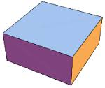
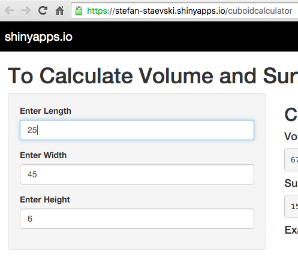
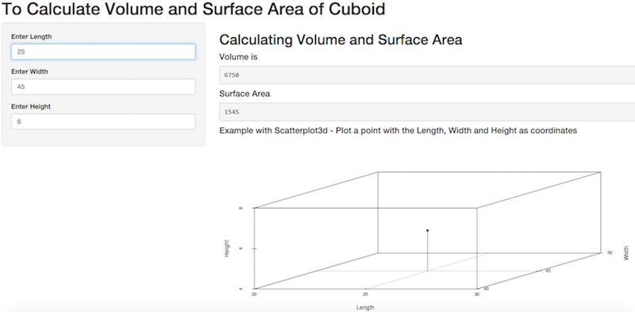

---
title       : Presentation of the shiny app cuboidcalculator
subtitle    : The App is made for the course Data Scientist on Coursera
author      : Stefan Staevski
job         : Data Scientist Student
framework   : io2012        # {io2012, html5slides, shower, dzslides, ...}
highlighter : highlight.js  # {highlight.js, prettify, highlight}
hitheme     : tomorrow      # 
logo        : imgres.jpg
widgets     : []            # {mathjax, quiz, bootstrap}
mode        : selfcontained # {standalone, draft}
knit        : slidify::knit2slides

--- .class #id 

##  1. The shiny App - Cuboidcalculator

This application allows the user to enter the length, width, and height and calculate the Volume and the Surface Area of a Cuboid.

It uses Scatterplot3d to plot a point with the Length, Width and the Height as coordinates.

Three text boxes are created to enter length, width, height and calculations for Volume and Surface Area are done in the server.R

--- .class #id 

##  2. The Input

Three text boxes are created to enter length, width, height:



--- .class #id 

##  3. The Output

The server calculates the Volume and the Surface Area of a Cuboid. It uses Scatterplot3d to plot a point with the Length, Width and the Height as coordinates:



--- .class #id 

##  4. Live Example

<h3>Thank you very much for watching!</h3>


To try the Cuboidcalculator Check this URL:


```
## [1] "https://stefan-staevski.shinyapps.io/cuboidcalculator"
```


Current Date and Time: 
  

```
## [1] "2015-11-22 21:45:20 CET"
```


